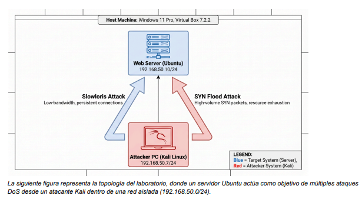
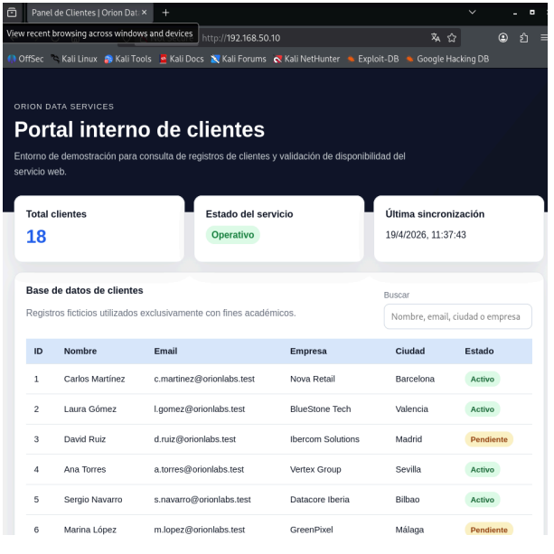
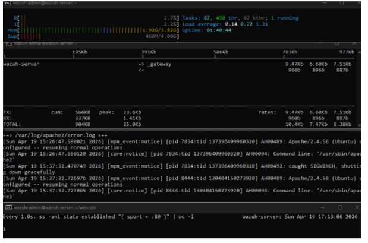
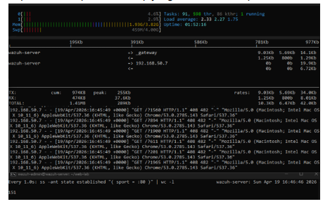
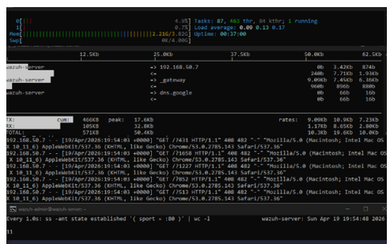
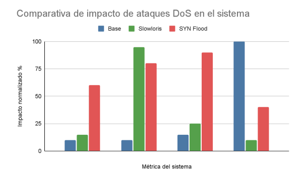

Proyecto de ciberseguridad centrado en el análisis de ataques de denegación de servicio (DoS) y la implementación de medidas de mitigación en un entorno de laboratorio controlado.

En este proyecto se simula un entorno realista con:

Servidor Ubuntu con Apache
Máquina atacante Kali Linux
Aplicación web básica con datos simulados
Monitorización del sistema en tiempo real



Se analizan dos tipos de ataques:

Slowloris (capa de aplicación)
SYN Flood (capa de red)

Tecnologías utilizadas:

VirtualBox
Ubuntu Server
Kali Linux
Apache2
hping3
Slowloris
htop, ss, iftop
Wireshark

Estructura del proyecto
``` id="1qgz3t"
   proyecto-dos-ciberseguridad
 ├── README.md
 ├── Proyecto_DoS.pdf
 ├── assets/
 │    ├── topologia.png
 │    ├── htop_baseline.png
 │    ├── htop_ataque.png
 │    ├── htop_mitigacion.png
 │    ├── web.png
 │    └── comparativa.png
 └── web/
      ├── index.html
      ├── style.css
      ├── app.js
      └── clientes.json
```


Web creada y operativa.

 Objetivo:

Analizar el impacto de ataques DoS sobre un servidor web y aplicar medidas de mitigación para mantener la disponibilidad del servicio.

Medidas de mitigación
Nivel aplicación (Apache)
mod_reqtimeout
Control de timeouts
Optimización de conexiones
Nivel red (kernel + firewall)
SYN cookies
Ajustes sysctl
Reglas iptables

Monitorización del sistema
  Estado normal (baseline)
Bajo consumo de CPU
Pocas conexiones activas
Sistema estable



  Bajo ataque
Incremento de conexiones
Saturación del servicio
Degradación de disponibilidad



  Con mitigaciones aplicadas
Reducción de conexiones maliciosas
Sistema estable
Servicio operativo



  Comparativa de resultados


  
Conclusiones clave:
Slowloris → satura conexiones HTTP
SYN Flood → satura la pila TCP
Las mitigaciones reducen significativamente el impacto

Resultados clave

Durante el proyecto se analizaron dos ataques de denegación de servicio: Slowloris y SYN Flood, comparando el estado normal del sistema, el comportamiento bajo ataque y la situación tras aplicar mitigaciones.

Ataque Slowloris

Antes de aplicar defensas, el ataque Slowloris provocó una degradación clara del servicio web:

- Conexiones TCP persistentes: entre 80 y 120 conexiones.
- Tráfico de red bajo pero constante: entre 50 y 200 Kb/s.
- Tiempo de respuesta elevado: entre 2 y 10 segundos, llegando a timeouts.
- El consumo de CPU se mantuvo bajo, demostrando que el ataque no necesita saturar CPU o RAM para afectar al servicio.

Tras aplicar mitigaciones con _mod_reqtimeout_ y ajustes en Apache:

- Las conexiones TCP se redujeron a entre 10 y 30.
- El tráfico se mantuvo por debajo de 100 Kb/s.
- El tiempo de respuesta volvió a estar por debajo de 200 ms.
- El servicio web continuó operativo.

Ataque SYN Flood

Durante el ataque SYN Flood se observó un impacto más directo sobre la pila TCP del sistema:

- Conexiones en estado SYN_RECV: entre 100 y 300.
- Tráfico de red elevado: entre 3 y 10 Mb/s.
- Tiempo de respuesta: entre 500 ms y 3 segundos.
- Aumento moderado del consumo de CPU, entre 10% y 25%.

Tras aplicar mitigaciones mediante _sysctl_, _SYN cookies_ e _iptables_:

- Las conexiones TCP se redujeron a entre 10 y 40.
- El tráfico bajó a menos de 1 Mb/s.
- El tiempo de respuesta volvió a estar por debajo de 200 ms.
- El servidor mantuvo la disponibilidad del servicio.

Conclusión de resultados

Las medidas aplicadas no eliminan completamente el impacto de los ataques, pero reducen de forma significativa su efectividad y permiten mantener el servicio web disponible en condiciones adversas.

Qué aprendí

Con este proyecto he aprendido a construir y analizar un entorno completo de ciberseguridad desde cero, incluyendo la parte ofensiva, defensiva y de monitorización.

### Aprendizajes principales

- Comprender cómo funcionan los ataques DoS en distintas capas del modelo de red.
- Diferenciar entre un ataque de capa 7 como Slowloris y un ataque de capa 4 como SYN Flood.
- Analizar métricas del sistema en tiempo real usando herramientas como _htop_, _ss_, _iftop_, _curl_ y _Wireshark_.
- Entender que un servidor puede dejar de responder aunque la CPU y la RAM no estén saturadas.
- Aplicar mitigaciones específicas según el tipo de ataque.
- Configurar Apache para limitar conexiones lentas mediante _mod_reqtimeout._
- Ajustar parámetros del kernel con _sysctl_ para mejorar la defensa frente a SYN Flood.
- Usar reglas de _iptables_ para limitar conexiones sospechosas.
- Adaptar el alcance de un proyecto técnico a las limitaciones reales del hardware disponible.

Reflexión final

Este proyecto me ha permitido entender de forma práctica que la disponibilidad de un servicio no depende solo de que el servidor esté encendido, sino también de cómo gestiona las conexiones, los tiempos de espera y el tráfico malicioso.

También he aprendido la importancia de aplicar una defensa multicapa, combinando medidas a nivel de aplicación, sistema operativo y firewall.
Autor

Alex Guidus

⚠️ Nota

Proyecto realizado en entorno controlado con fines educativos.
